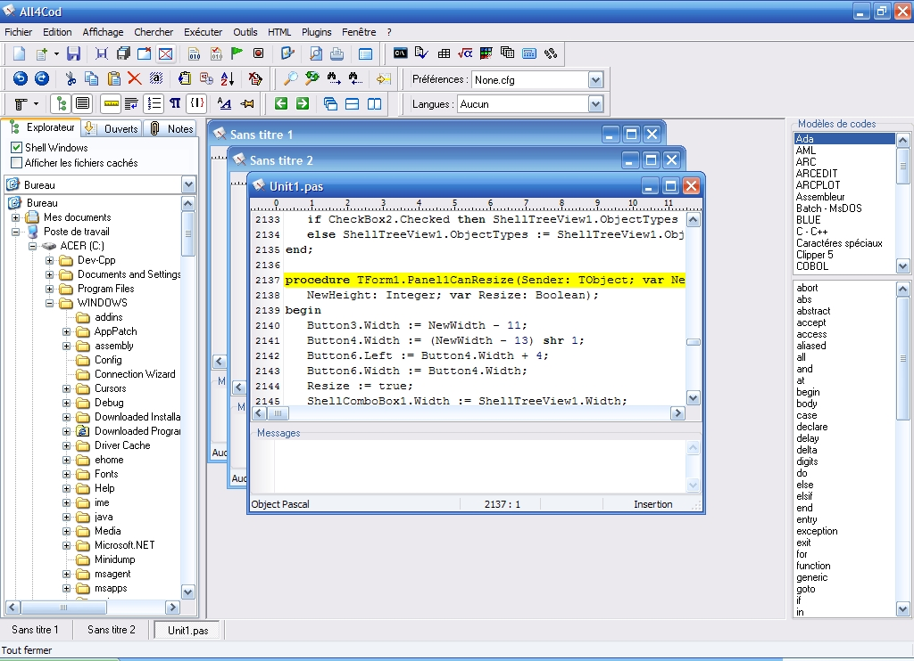

# All4Cod
 

  <!-- Stability -->
  
  <!-- Standard -->
  
  <!-- Standard -->
  

 
All4Cod is a text editor/IDE for programmers with syntax highlighting (using SynEdit).
Syntax highlighting can be customised and you can create your own highlighter.

## Features:

- Spell checking
- ASCII table
- Expression evaluator
- Print/Preview
- Terminal
- RGB color chooser
- Base conversion
- Hashes
- ...

Written with Delphi for Windows XP but still run on Windows 10 !

## Screenshots

  </td>

